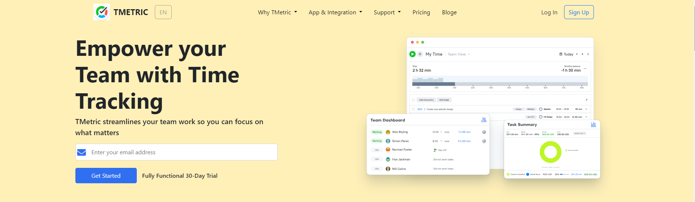
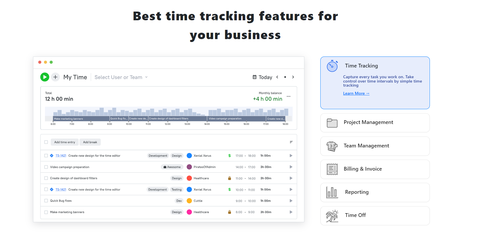
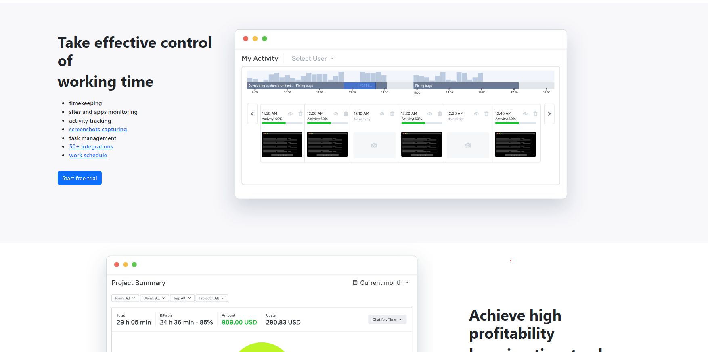
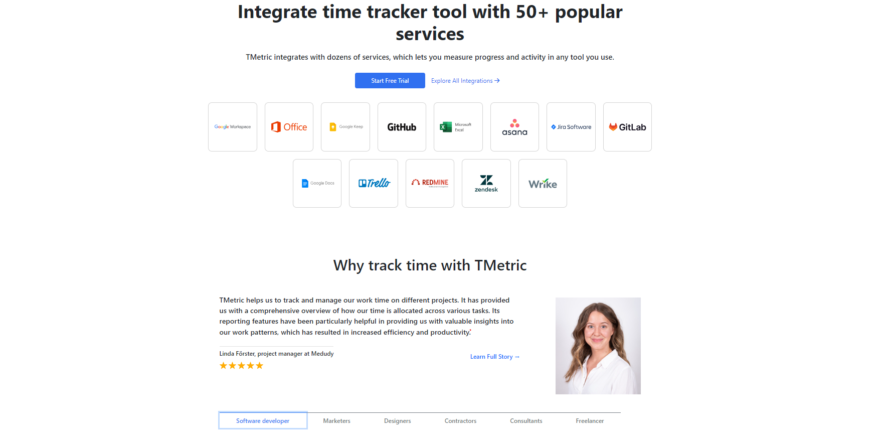
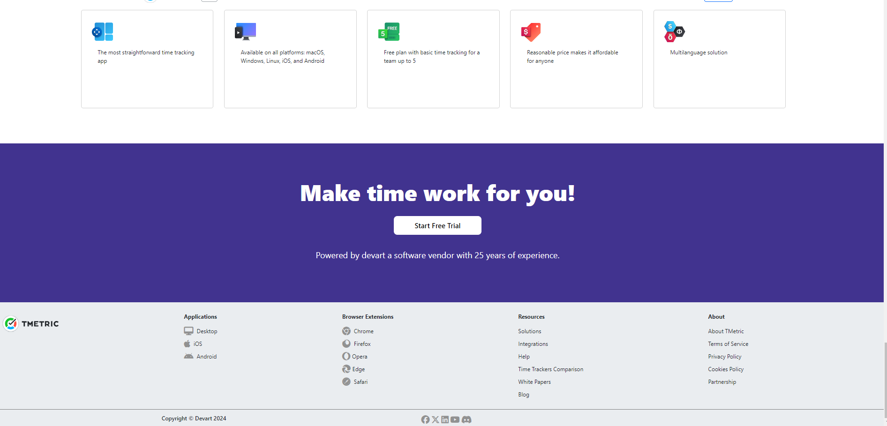
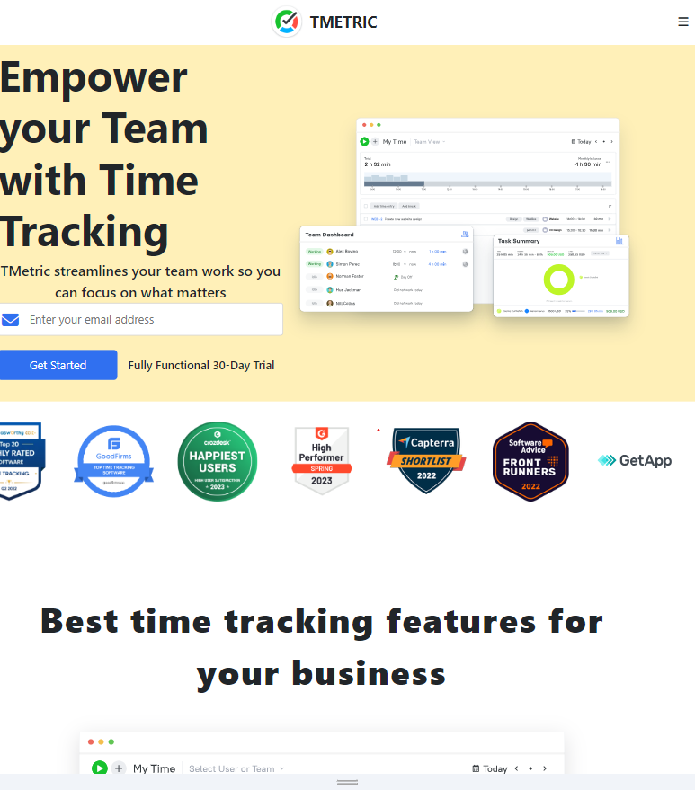
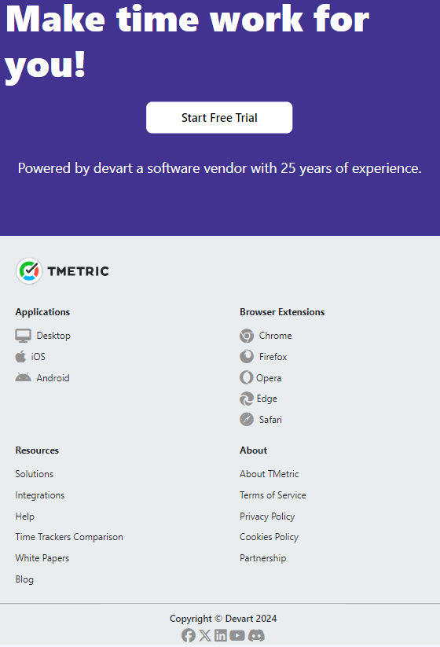

## TMETRIC

Metric is a time tracking app that delivers the best solutions for increased profitability of your business with the most efficient time and resource management.

### Presentation video
[video](https://youtu.be/C0LW5FLTsZM)

### Deployed Link

[TMETRIC Demo](https://660a9c17d2b5ac9413a8c893--gregarious-rabanadas-c8b13b.netlify.app/)
[Figma](https://660aa070d2b5ac9765a8c74b--chipper-alfajores-594270.netlify.app/)

### Screenshots

#### Mobile View

## Features

- **Navbar and Footer**: Both have a fixed providing consistent navigation and information throughout the page.
- **Dynamic Design**: A single-page component with fluid layout adjustments to accommodate different screen sizes, ensuring a seamless user experience.

- **Get starte Button**: To get started with your free trials.
- **Header and Images**: To showcase the actual representation of applcation
- **Responsive Hamburger Menu**: Ensures accessibility and ease of navigation on smaller devices.

## Tech Stack

- **HTML**: Provides the structure and content for the web page.
- **CSS**: Handles the UI and styling, ensuring an appealing visual presentation.
- **Bootsrtap**: Implements functionality such as the accordion, Navbar, Containers And Nav-tabs.

### Design Elements

1. **Media Queries:**
   Media queries are utilized to ensure the website's responsiveness across various screen sizes. By adjusting the layout and styling dynamically, the website offers an optimal viewing experience on different devices.

2. **Responsive Design:**
  Utilizes media queries and flex layouts to adapt the page layout across various devices, ensuring a seamless browsing experience on mobile phones, tablets, and desktop computers.

3. **Fonts & Icons:**
  Integrates Google Fonts and FontAwesome icons for enhanced typography and visual elements. By leveraging these resources, the website achieves a modern and visually appealing design, improving readability and user engagement.   

## How to Use

To run this project locally:

1. Clone this repository to your local machine.
2. Run $ npm install bootstrap  in the directory
3. Run index.html using live server extension. 

## Contributors

- [Chaitanya Dakhale](https://github.com/Chaitanya-05)
- [Sathwik Reddy](https://github.com/sathwikreddy122)
- [Himanshu Rajput](https://github.com/HimanshuRajpoot2301)
- [Rakesh Mahji](https://github.com/Rakeshkrmajhi)

## Acknowledgments

- This project was done for our construct week. During a masai-school journey to make practicle use of our coding and testing skills that we have learned in our masai journey till date.
- Special thanks to the Masaischool.